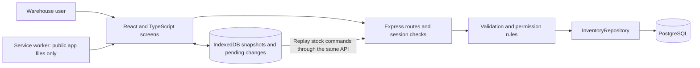
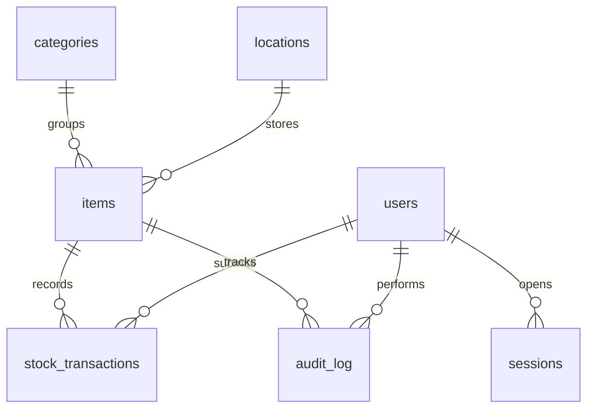

# How the web version is organized

The original WarehouseInventoryActivity calls DBHelper, filters the returned list, and builds the cards. InventoryItemFormActivity checks the form and writes through DBHelper. The web version separates those jobs so they can be tested without an Android screen.

`App.tsx` handles screens and form state. It does not build SQL. `api.ts` sends requests and keeps the CSRF token in memory. `offline.ts` owns IndexedDB reads and writes. `sync.mjs` walks the queue and removes a command only after explicit acceptance.

The Express routes check the session and the action allowed for its role. Validation runs again on the server even when the browser form has already checked a value. The repository owns SQL and transaction boundaries. PostgreSQL checks relationships, SKUs, and numeric limits.

A stock change has an operation ID, an item ID, a signed quantity change, and a reason. The server gets the user from the session, never from a submitted user ID. It serializes matching operation IDs and locks the item row before changing its balance. The ledger, balance, and audit record commit together. Retrying the same operation returns the saved result. Reusing the ID for a different operation fails.

The quantity column is a stored balance maintained alongside the append-only ledger. This is not a complete event-sourcing platform. A test compares the balance with the sum of accepted ledger changes. Corrections should use another signed adjustment with a reason, not a rewrite of old history.

## Design trade-offs

The PWA works across screen sizes, but a shared service needs authentication, error handling, and conflict rules that the local Android app did not need. Offline support adds another boundary: a count shown on the device may be old. The UI therefore shows a confirmed count separately from pending changes.

The first implementation caches the last viewed page set. That keeps offline behavior understandable without downloading the full inventory. Requests on reconnect use deltas rather than replacing a server quantity with an old local quantity. The server may reject a previously reasonable request if stock was used while the device was disconnected.

Search and filter results come from the database with capped page sizes. The hand-built data structures remain a later enhancement. A limit on the returned rows does not prove every search is fast; an ILIKE search can still scan records. No benchmark result is claimed for this milestone.
